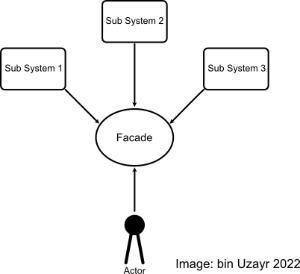

# ReadMe

## GitHub Repository
Project Github Repository: [https://github.com/rmit-wdt-sp2-2023/s3893749-s3912792-a1](https://github.com/rmit-wdt-sp2-2023/s3893749-s3912792-a1)

## Used Design Patterns:

### Dependency Injection

Dependency Injection (DI) is a design pattern that facilitates code reuse by decoupling the usage of an object from its 
creation. It enables the replacement of dependencies without changing the class that uses them (Thorben 2023). DI can 
get applied in three forms: 
1. Constructor Injection
2. Setter or Property Injection
3. Interface Injection. 
 
These are sometimes called type 3 IoC, type 2 IoC and type 1 IoC, respectively, where IoC stands for Inversion of Control 
(Fowler 2004).  
The DI can help in solving the following problems:  

- How can a class be independent of the creation of objects it depends on?
- How can an application support different configurations?
- How can the behaviour of code get changed without it getting edited directly? (Franke 2021)

Dependency Injection is one of the so-called creational design patterns (Nesteruk 2022) and makes it easier to change an 
application's behaviour by changing components that implement interfaces that define features. It also produces members 
that are easier to isolate for unit testing (Freeman 2022). However, according to Fowler (2004), DI can also assist in 
making a system 'portable', meaning, if we had a system that uses a method to read data from a file for one user, it 
would be easier to change that method to read data from a database or an XML file for another user, without changing the 
code for the class that uses the data. This flexibility is where the power of DI lies.

 We use DI in the following way in the form of constructor injection:

We define an Interface for the balance check that provides an abstract method.

```cs
public interface IBalanceCheck
{
    public bool CheckMinBalance(decimal sourceBalance, string accountType, decimal amount);
}
```

Then we define the class BalanceValidatoinLogic as follows:

```cs
public class BalanceValidationLogic
{
    private readonly IBalanceCheck _balanceCheck;

    public BalanceValidationLogic(IBalanceCheck balanceCheck)
    {
        _balanceCheck = balanceCheck;
    }

    public BalanceValidationLogic()
    {
        _balanceCheck = new BalanceValidator();
    }

    public bool PerformBalanceValidation(decimal sourceBalance, string accountType, decimal amount)
    {
        return _balanceCheck.CheckMinBalance(sourceBalance, accountType, amount);
    }
}
```

This class contains the constructor with one parameter of type IBalanceCheck. Now the calling class (PerformTransfer or 
PerformWithdrawal) injects an object of type IBalanceCheck.

```cs
public class PerformTransfer
{
    private readonly BalanceValidationLogic _balanceValidator;
    
    public PerformTransfer()
    {
        _balanceValidator = new BalanceValidationLogic(new BalanceValidator());
    }
    
    public bool Transfer(Account sourceAccount, Account destinationAccount, decimal amount, string comment)
    {
	}
}
```

The BalanceValidationLogic class creates and injects the BalanceValidator object into the PerformTransfer class. This 
way, the PerformTransfer and the BalanceValidator classes become more loosely coupled.

### Façade Design Pattern:

The App.cs file uses a façade design pattern. The Façade Pattern is a structural design pattern often used to create more unified interfaces to complex systems. This way, access to the underlying methods is simplified (bin Uzayr 2022). The façade pattern is one of the Gang of Four (GoF) design patterns published in 1994 by authors Erich Gamma, Ralph Johnson, Richard Helm, and John Vlissides (Unknown 2021).

It gets called a façade because, like the façade of a building, it provides access but hides the underlying functionalities. Following this approach, the App.cs class is a universal façade class that forms a single entry point. It acts as an interface for the underlying systems by calling methods like Start(), GetCurrentUser() and SwitchView().

With a moderately complex system like ours, it is appropriate to use a façade pattern as it hides the complexity (Kumar 2023).



In our code this pattern can get observed in the App.cs file in the following way:
```csharp
public class App
{
    public static void RegisterView(View view)
    {
        Kernal.Instance().RegisterView(view);
    }
    
    public static void RegisterView(View view, bool defaultView)
    {
        Kernal.Instance().RegisterView(view);

        if (defaultView)
        {
            Kernal.Instance().SetActiveView(view.GetType().Name);
        }
    }

   ...

    public static void SetCurrentUser(Customer customer)
    {
        Kernal.Instance().setCustomer(customer);
    }

    public static void SwitchView(string view)
    {
        Kernal.Instance().SetActiveView(view);
    }

    public static void Start(string view)
    {
        Kernal.Instance().Boot();
        Kernal.Instance().SetActiveView(view);
        Kernal.Instance().Process();
    }

    public static ConsoleFacade Console()
    {
        return new ConsoleFacade();
    }
    
    public static void SetViewVariable(string view, string key, object value)
    {
        Kernal.Instance().SetViewVariable(view,key,value);
    }

    public static void LoadConfiguration(string path)
    {
        Kernal.Instance().SetConfigurationFile(path);
    }

    public static IConfigurationRoot Config()
    {
        return Kernal.Instance().GetConfig();
    }

    public static void RegisterServiceProvider(ServiceProvider provider)
    {
        Kernal.Instance().RegisterServiceProvider(provider);
    }
    
    
}
```


### MVC Design Pattern:

One of the best-known design patterns is the Model-View-Controller (MVC) pattern. Its purpose is to separate internal representations of information from how it gets presented to the user (Reenskaug & Coplien 2009). Initially used for graphical user interfaces, this pattern became standard for web applications. Trygve Reenskaug created the MVC design pattern in the late 1970s. He wanted a design pattern to structure any program where users interact with a large data set. Initially, his design had four parts: Model, View, Thing, and Editor. However, he and the rest of his group eventually settled on model, view, and controller (Reenskaug 1979).

The MVC pattern consists of three components. The model represents the central component of an application's dynamic data structure. It is independent of the user interface. The model manages the application's data, rules and logic and often gets represented by a database in modern web applications.

The view is a representation of this information. While in the past, it usually consisted only of a chart, modern web applications use HTML templates. The view can receive input from the user but is general-purpose and composable (Fowler 2006).

The controller handles user events. At any given time, it has one associated view and model. While a model object can hear from many controllers, only one controller (the "active" controller) receives input at any given time (LaLonde & Pugh 2009). The active controller usually gets set by a global window manager.

In our application, we implemented the MVC pattern using the façade (window manager) to implement the required controller (framework). The model and its connected controllers got placed in the class library (MyBankDbAccess), whose sole purpose is to handle data to and from the database.

### The 'required' modifier:

The required modifier indicates that the property it gets applied to must be initialised by an object initialiser and got introduced with C# 11. Any expression that initialises a new instance of this type must initialise all required members why we use the required modifier in our model types for essential fields. This restriction allows code to create classes that require proper initialisation of properties with the flexibility of still using object initialisers. The required modifier can get applied to fields and properties declared in classes and structs, including record and record structs and interfaces.

Required properties or fields must be, at a minimum, as visible as their containing type and have setters (set or init accessors) that are at least as visible as their containing type. Some types use a primary constructor to initialise positional properties. The primary constructor adds the [SetsRequiredMembers] attribute if those properties include the required modifier. This setting indicates that the primary constructor initialises all the necessary members.

However, the compiler doesn't verify that these constructors do initialise all required members. Instead, the attribute asserts to the compiler that the constructor does initialise all required members. In principle, the [SetsRequiredMembers] disables the compiler's checks that all required members get initialised upon the creation of an object (Wagner & Bryant 2023). We use the required modifier within our model classes for the customer ID property in Customer and Account, the login ID in Login, and the account number and transaction type properties in Transaction. We've chosen these fields to be required because, in the case of the Account, Customer and Login classes, they resemble the primary key columns in the database tables. But also they define the sole property that references them.

In the Transaction class, we focus on the account number and transaction type, as the user never sets the primary key. The account number, however, is the crucial reference for each transaction and hence essential. In addition, the transaction type determines if a fee applies and should also be required.

An example would be:
```csharp
public class Customer
{
    public Customer()
    {
    }

    [SetsRequiredMembers]
    public Customer(int customerId, string name, string? address, string? city, string? postCode)
    {
        CustomerID = customerId;
        Name = name;
        Address = address;
        City = city;
        PostCode = postCode;
    }
    
    [PrimaryKey] public required int CustomerID { get; set; }
    public string Name { get; set; }
    public string? Address { get; set; }
    public string? City { get; set; }
    public string? PostCode { get; set; }
    [SkipProperty] public List<Account> Accounts { get; set; }
    [SkipProperty] public Login Login { get; set; }
```

### The use of async and await
The code in a C# program usually gets executed sequentially, line by line. In most programs, this usually does not affect 
performance. However, when involving components like web services, HTTP requests or file loading, we deal with processes 
that sometimes are delayed. This potential delay leads to a synchronous process having to wait, which can delay the 
whole program. The solution to this problem is asynchrony. Asynchrony is essential for potentially blocking activities, 
such as web access. The entire application must wait if such activity gets blocked in a synchronous process. In an 
asynchronous process, the application can continue with other work that does not depend on the web resource until the 
potentially blocking task finishes (Wagner & Kulikov 2023).  

Most programming languages have a way to deal with this asynchrony. However, they sometimes require cumbersome callback 
calls, but modern C# allows this kind of code to be written to look like synchronous code (Skeet 2019). In C#, 
asynchronous code can get declared with the 'async' keyword in the method definition. Async methods usually return a 
Task (Task<TResult>) and not a type; why the return type gets substituted by a Task. This Task can return a value if 
required which is written in the form of Taks<return type> (Wagner 2023). In our application we use async/await for 
loading data from the web service. This process can potentially take a long time as we have to fetch data from the web 
and write it o the database, both processes reliant on the internet. We implemented asynchronous code in the following 
way:
```csharp
 public static async Task GetAndAddCustomers()
    {
        if (new Database<Customer>().CheckForDatabaseDataPresence())
        {
            return;
        }

        var customers = await RestApiRequest.RestCallAsync();

        foreach (var customer in customers)
        {...}
```

## References

Fowler, M 2004, Inversion of Control Containers and the Dependency Injection pattern, MartinFowler.com, accessed 27 June 2023, <https://martinfowler.com/articles/injection.html>.  

Fowler, M 2006, GUI Architectures, MartinFowler.com, accessed 29 June 2023, <https://martinfowler.com/eaaDev/uiArchs.html#ModelViewController>.  

Franke, G 2021, GoF Design Patterns Reference, w3s Design, accessed 30 June 2023, <http://w3sdesign.com/?gr=u01&ugr=proble>.  

Freeman, A 2022, Using Dependency Injection, in Pro ASP.NET Core 6, Apress, Berkeley, CA, pp. 353–389.  

Kumar, S 2023, Facade Design Pattern | Introduction, GeeksforGeeks, accessed 28 June 2023, <https://www.geeksforgeeks.org/facade-design-pattern-introduction/>.  

LaLonde, WR & Pugh, JR 2009, Inside Smalltalk, Volume 3, Prentice Hall.  

Nesteruk, D 2022, Design Patterns in .NET 6, Apress, Berkeley, CA.  

Reenskaug, T 1979, Trygve/MVC, MVC, accessed 29 June 2023, <https://folk.universitetetioslo.no/trygver/themes/mvc/mvc-index.html>.  

Reenskaug, T & Coplien, J 2009, The DCI Architecture: A New Vision of Object-Oriented Programming, Artima, accessed 28 June 2023, <https://web.archive.org/web/20090323032904/https://www.artima.com/articles/dci_vision.html>.  

Skeet, J 2019, C# in Depth, Fourth Edi, Manning Publications, Shelter Island.  

Thorben 2023, Design Patterns Explained – Dependency Injection with Code Examples, Stackify, accessed 27 June 2023, <https://stackify.com/dependency-injection/>.  

Unknown 2021, Facade pattern: unified interface for software projects , IONOS Products, accessed 28 June 2023, <https://www.ionos.com/digitalguide/websites/web-development/whats-the-facade-pattern/>.  

bin Uzayr, S 2022, Software Design Patterns, First Edit, CRC Press, Boca Raton.  

Wagner, B & Bryant, B 2023, required modifier - C# Reference, Microsoft Learn, accessed 29 June 2023, <https://learn.microsoft.com/en-us/dotnet/csharp/language-reference/keywords/required>.  

Wagner, W 2023, Asynchronous programming - C# , Microsoft Learn, accessed 30 June 2023, <https://learn.microsoft.com/en-us/dotnet/csharp/asynchronous-programming/async-scenarios>.  

Wagner, W & Kulikov, P 2023, The Task Asynchronous Programming (TAP) model with async and await" , Microsoft Learn, accessed 30 June 2023, <https://learn.microsoft.com/en-us/dotnet/csharp/asynchronous-programming/task-asynchronous-programming-model>.


